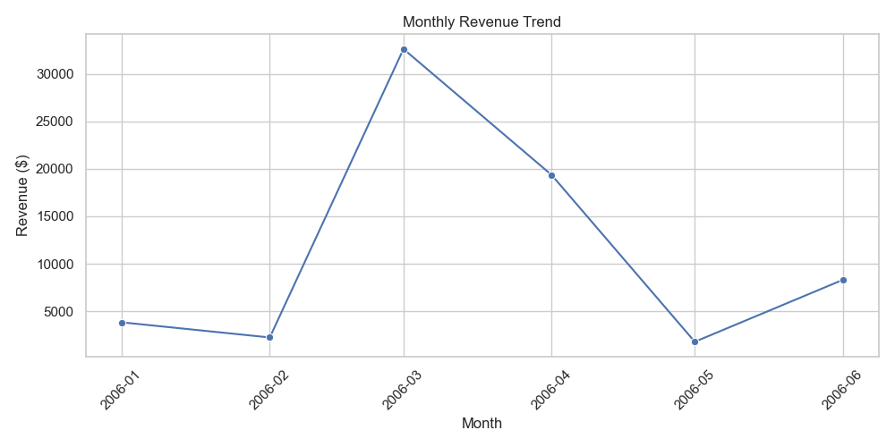
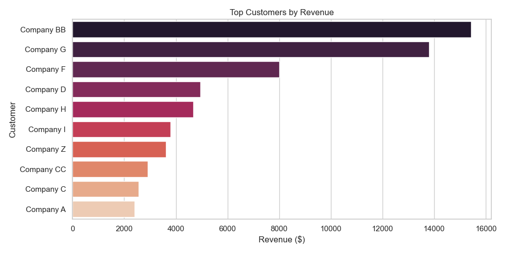
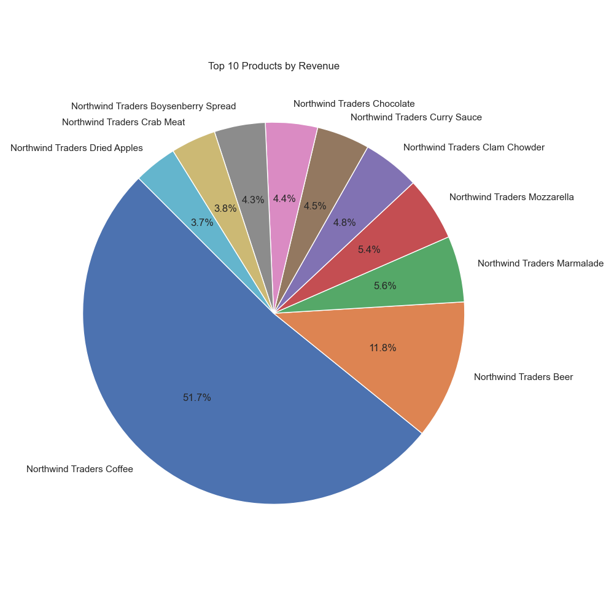

## Northwind Sales Analysis — Data Analyst Portfolio Project

This project simulates the work of a junior data analyst by analyzing transactional and customer data from the **Northwind Traders** dataset using **MySQL** and **Python**. It answers real business questions related to customer value, product performance, and revenue trends.

---

## Questions

- What are the monthly revenue trends?
- Who are the highest-spending customers?
- Which products generate the most revenue?
- How are customers segmented by their lifetime value?
- What proportion of customers are repeat buyers?
- What is the average order value distribution?

---

## Key Insights

1. **Revenue peaked in March** and was above average in April, suggesting seasonal demand.

2. The **top 5 customers contributed over 65%** of total revenue — showing heavy dependence on a few clients.

3. Top products included **Coffee, Beer, and Marmalade**, suggesting a preference for daily-use consumables.

4. Over **75% of customers** fell into the **Low Value segment** based on total spend.
5. **All of the customers placed repeat orders**, indicating excellent retention.
6. The **average order value** was mostly **below \$200**, with a long right-tail of premium purchases.

---

## Recommendations

- **Diversify the customer base** to reduce reliance on the top 5 clients.
- **Target low-value customers** with personalized upsell campaigns.
- Promote high-performing products during slower months to smooth revenue.
- Consider **loyalty or subscription models**, given the strong retention.
- Optimize pricing to increase average order value beyond \$200.

---

## Tools Used

| Tool      | Purpose                          |
|-----------|----------------------------------|
| MySQL     | Data extraction and querying     |
| Pandas    | Data handling and manipulation   |
| Seaborn   | Visualization                    |
| Matplotlib| Chart customization              |
| Jupyter   | Notebook documentation           |

---

## Project Structure

```text
northwind-sales-analysis/
├── SQL Queries/
├── CSV Exports/
├── visuals/
├── Northwind_Analysis.ipynb
└── README.md


---

## Next Steps

- Build a Tableau dashboard for interactivity
- Apply RFM segmentation to better classify customers
- Develop a churn prediction model for proactive outreach

---

## 👤 Author

**Pratyush Pranjal**
Aspiring Data Analyst | Mechanical Engineer | SQL & Python Enthusiast  
www.linkedin.com/in/pratyushpranjal
